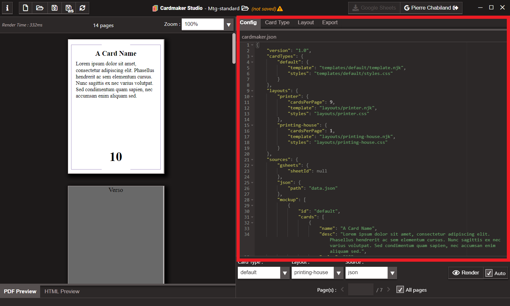
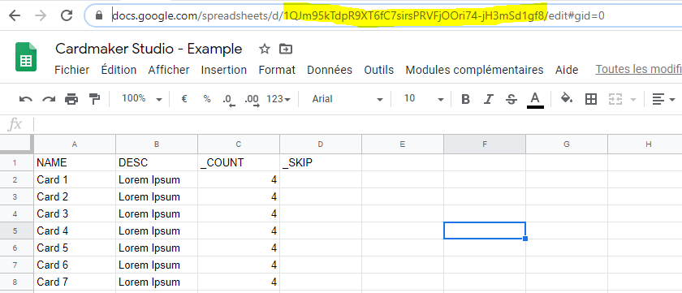

[#configuration]
= Configuration
:toc:

The configuration is ```cardmaker.json```. It can be edited ine the editor on the Config tab on the right of the editor

.Configuration tab
[.text-center]


== Card Types

``cardTypes`` is a dictionary of templates. The key is the card type id. The value is an object with two attributes : 

- ``template`` : the path of the html/nunjucks template file relative to the folder project.
- ``styles`` : the path of the CSS file relative to the folder project.

.Card type in the template MTG Standard
[source,json]
----
"cardTypes": {
    "default": {
        "template": "templates/default/template.njk",
        "styles": "templates/default/styles.css"
    }
},
----

Refer to <<overview.adoc#card-type-templates,Card type Overview>> and <<templating.adoc#card-types,Templating Card Types>> for more information.

== Layouts

``layouts`` is a dictionary of templates. The key is the layout id. The value is an object with three attributes : 

- ``cardsPerPage`` : the number of cards displayed by pages
- ``template`` : the path of the html/nunjucks template file relative to the folder project.
- ``styles`` : the path of the CSS file relative to the folder project.

.Layouts in the template MTG Standard
[source,json]
----
"layouts": {
    "printer": {
        "cardsPerPage":9,
        "template": "layouts/printer.njk",
        "styles": "layouts/printer.css"
    },
    "printing-house": {
        "cardsPerPage":1,
        "template": "layouts/printing-house.njk",
        "styles": "layouts/printing-house.css"
    }
},
----

Refer to <<overview.adoc#layout-templates,Layout Overview>> and <<templating.adoc#layouts,Templating Layouts>> for more information.

== Sources

=== Google Sheets

Google Sheets need one thing ``sheetId`` : the id of the spreadsheet from which to retrieve data. 
It can be found here : 



.Example of Google Sheets Source
[source,json]
----
"sources": {
    "gsheets": {
        "sheetId": "1QJm95kTdpR9XT6fC7sirsPRVFjOOri74-jH3mSd1gf8"
    }
}
----

Refer to <<data.adoc#google-sheets,Google Sheet Data Source>> for more information.

=== External JSON

- ``path`` the path of the json file relative of the project folder.

.External JSON source in the template MTG Standard
[source,json]
----
"sources": {
  
    "json": {
        "path": "data.json"
    }
}
----

Refer to <<data.adoc#json-format,JSON Data Source>> for more information.

=== Mockup 

Mockup data are plain json directly ine the cardmaker.json.
Refer to <<data.adoc#json-format,JSON Data Source>> for more details.

.Mockup source in the template MTG Standard
[source,json]
----
"sources": {
    "mockup": [
        {
            "id": "default",
            "cards": [
                {
                    "name": "A Card Name",
                    "desc": "Lorem ipsum dolor sit amet, consectetur adipiscing elit. Phasellus hendrerit ac sem elementum cursus. Nunc sagittis ex nec varius volutpat. Sed condimentum quam sapien, nec accumsan enim aliquam sed.",
                    "value": "10",
                    "_COUNT": "11"
                }
            ]
        }
    ]
}
----
