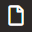
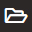
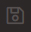
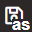
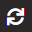
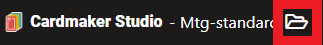

= Overview
:toc:

Card Designer is an editor dedicated to the creation of playing cards.

== Project Concepts

Architecture

A project contains some parts : 

=== A configuration file

The configuration file is ```cardmaker.json```.

Refer to <<configuration.adoc#configuration,Configuration Part>> for more information.


=== Card type templates

Card types templates defined different types of card with different types of data to fill them. They wrote in HTML/CSS with a templating language call https://mozilla.github.io/nunjucks/[Nunjucks]. One template per different type of card. 

Ex : If you would write Magic the gathering cards :

- creatures use a specific template
- planeswalker another template
- Instant, Sorcery, Enchantment and Artifact another card type template

Refer to <<configuration.adoc#card-types,Card Type Configuration>> and <<templating.adoc#card-types,Write Card Type>> for more information.

=== Layout templates

Layout templates are also written with the same system above (HTML/CSS/Nunjucks).

Layouts provide a covenant way to define different sort of print formats. 
Need a format to print on the office printer without verso and a format for the printing house with verso? Layout templates can specify that. 

Refer to <<configuration.adoc#layouts,Layouts Configuration>> and <<templating.adoc#layouts,Write Layout>> for more information.

=== Data Source types

Card type templates need to be filled with data to create fully cards.
Data sources types provide different manner to provide data to the editor. 
All data are written in https://en.wikipedia.org/wiki/JSON[JSON]

=== Mockup Data Source

Mockup Data are filled in the configuration file ```cardmaker.json```.

Refer to <<configuration.adoc#mockup,Mockup Configuration>> for more information.

=== External JSON File Source

A JSON file in the project folder. Currently very basic support for it (Now reload data when the file change)

Refer to <<configuration.adoc#external-json,External JSON Configuration>> for more information.

=== Google Sheets Source

It's possible to link Google Sheets document to the editor to fetch data from it. 

Refer to <<configuration.adoc#google-sheets,Google Sheets Configuration>> for more information.


== Basic Project Operations

- Create a new project with 
- Open a new project with 
- Save the current project with 
- Duplicate the current project with 
- Refresh the current project 
- Open the folder of the current project with 

== Basic Manipulations

// here details for selecting card type, layout, render, pages etc...


